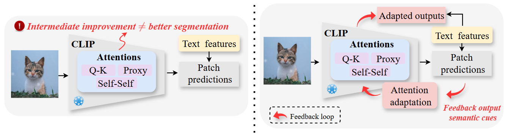

<div align="center">

<h1>Plug-in Feedback Self-adaptive Attention in CLIP for
Training-free Open-Vocabulary Segmentation</h1>

<div>
    <strong>Accepted to ICCV 2025</strong>
</div>


<div>
    <h4 align="center">
        • <a href="https://arxiv.org/abs/2508.20265" target='_blank'>[arXiv]</a> •
    </h4>
</div>

<br>
<div>
  
</div>

</div>

## TL;DR
> *Prior works refine intermediate attention but face limitations: (1) improvements may not propagate to final segmentation; (2) attention lacks direct class information. We introduce a feedback-driven self-adaptive mechanism that reintegrates semantic outputs with visual and textual cues into CLIP. Our approach is orthogonal to existing methods and serves as a plug-in.*

## News
* **` August 27，2025`**: Paper and code is released.
* **` June 26, 2025`**: FSA is accepted by ICCV 2025.

## Dependencies and Installation


```
# git clone this repository
git clone https://github.com/chi-chi-zx/FSA.git
cd FSA

# create new anaconda env
conda create -n FSA python=3.10
conda activate FSA

# install torch and dependencies
pip install -r requirements.txt
```


## Datasets
Please follow the [MMSeg data preparation document](https://github.com/open-mmlab/mmsegmentation/blob/main/docs/en/user_guides/2_dataset_prepare.md) and [ProxyCLIP](https://github.com/mc-lan/ProxyCLIP/tree/main) to download and pre-process the datasets. 
The COCO-Object dataset can be converted from COCO-Stuff164k by executing the following command:

```
python datasets/cvt_coco_object.py PATH_TO_COCO_STUFF164K -o PATH_TO_COCO164K
```

## Model evaluation

In this repo, we integrate our FSA into ProxyCLIP (using sam, mae, dino, dinov2 as the VFMs). Please check `hyper_param.txt` for the hyper parameters.

Please modify some settings in `configs/base_config.py` before running the evaluation.

The default VLM used in this code is [dino_vitb8](https://github.com/facebookresearch/dino). The same as the default one used in ProxyCLIP.

For SAM and MAE, please download the checkpoints from [SAM](https://github.com/facebookresearch/segment-anything#model-checkpoints) and [MAE](https://github.com/facebookresearch/mae).


Single-GPU:

```
python eval.py --config ./config/cfg_DATASET.py --workdir YOUR_WORK_DIR
```

Multi-GPU:
```
bash ./dist_test.sh ./config/cfg_DATASET.py
```

Evaluation on all datasets:
```
python eval_all.py
```
Results will be saved in `results.xlsx`.


## Citation

```
@inproceedings{chi2025fsa,
  title={Plug-in Feedback Self-adaptive Attention in CLIP for Training-free Open-Vocabulary Segmentation},
  author={Zhixiang Chi, Yanan Wu, Li Gu, Huan Liu, Ziqiang Wang, Yang Zhang, Yang Wang, Konstantinos N. Plataniotis },
  booktitle={Proceedings of the IEEE/CVF International Conference on Computer Vision},
  year={2025}
}
```

## Acknowledgement
This implementation is based on [OpenCLIP](https://github.com/mlfoundations/open_clip), [SCLIP](https://github.com/wangf3014/SCLIP) and [ProxyCLIP](https://github.com/mc-lan/ProxyCLIP/tree/main). Thanks for the awesome work.
